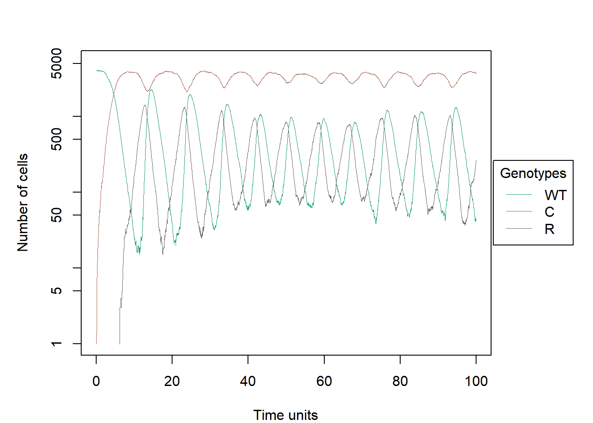
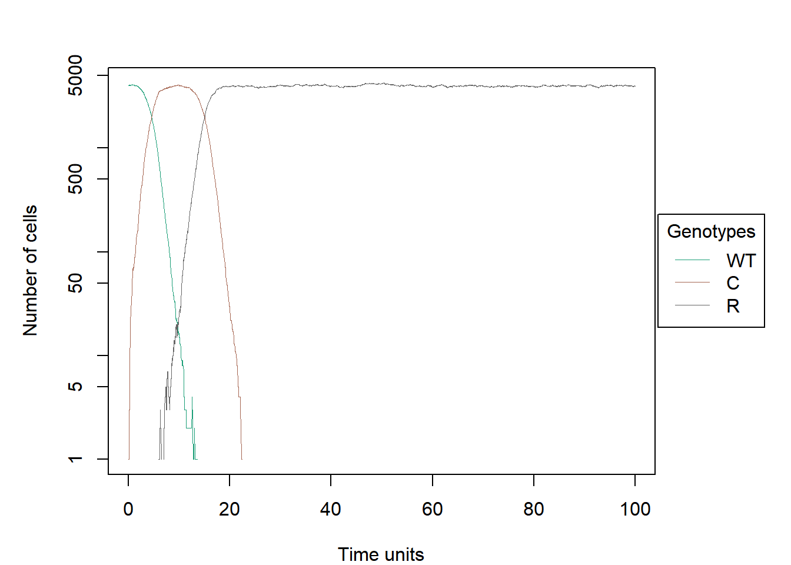
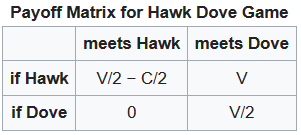
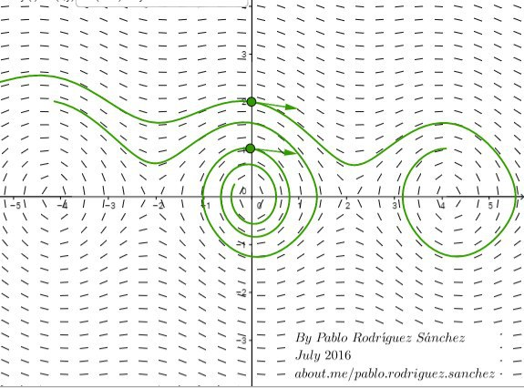
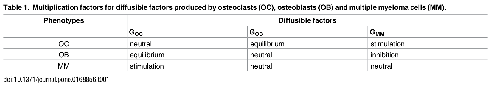

# Introduction
In the current bullet point, several examples are shown below from the 
literature on frequency-dependent fitness corresponding to the proposed exercise
2 programming for the subject Programming and Statistics with R (Master's Degree
in Bioinformatics and Computational Biology, Universidad Autónoma de Madrid) 
[[1]](#Archetti) [[2]](#Basanta) [[3]](#Chicken) [[7]](#Kaznatcheev) 
[[8]](#Kerr) [[10]](#Sartakhi) [[12]](#Williams).  
The OncoSimulR package [[4]](#Onco1)[[5]](#Onco2)[[6]](#Onco3) with the 
frequency-dependent fitness functionality has been used [[11]](#Sergio). 

To generate the current vignette, the cascading style sheets (CSS) from the 
OncoSimulR package have been used with slight modifications to keep as 
much similarity as possible. 

## News and functions used
The OncoSimulR package and ggplot2 are required to generate the vignette plots. 
For reproducible vignette results the seed has been fixed. The number of cores 
used to run the simulations has also been set to 4 (in case of Windows it will 
always be 1 by default), although the user can modify it if he wishes. 
The parallel programming package named parallel is used with  _L’Ecuyer-CMRG_
random number generator (RNG) in order to take advantage of the benefit of 
parallel computing. 
```{r message = FALSE, warning = FALSE}
## Packages
library(OncoSimulR)
library(ggplot2)

## Set a seed to oncoSimulIndiv 
set.seed(1)

## Set a seed to oncoSimulPop to allow reproducibility
library(parallel)
RNGkind("L'Ecuyer-CMRG")

## To allow modify the number of cores used in the cases of parallelization, 
## this macro can be set as the user wants
n_cores <- 4

## Get rid of the messages
options(stringsAsFactors = FALSE)
```

In the project we have added new functions (compositionPop2, simul_boxplot2, 
stripChartPop and meanCompositionPop) to plot the reproducibility
and distribution of the results of various simulations using boxplots 
(using ggplot2) and stripcharts. You can find these 
functions at _Functions_plot_markdown.R_. 

Box-plots allow representing the consensus of the last result between different
simulations. This type of representation is not always the desired one. In cases
with oscillating trajectories, it is preferable to represent the consensus 
between the means of the results from the middle of the simulation to its end 
between several simulations.

```{r}
## Import functions to plot box-plots and stripcharts
source("./Funciones_plot_markdown.R")

## Import modified plot.oncosimul for plotting legend outside the plot
source("legend_outside.R")
```

# Rock-paper-scissors model in bacterial community

## Introduction

This example is inspired by the article _Local dispersal promotes biodiversity_
_in a real game of rock paper scissors_ [[8]](#Kerr). It describes the relationship
between three populations of _Escherichia coli_, that turns out to be very
similar to a rock-paper-scissors game.

An E. coli community can have a specific strain of colicinogenic bacteria,
that are capable of creating colicin, a toxin to which this special strain is
resistant. The wild-type bacteria is killed by this toxin, but can mutate into
a resistant strain. 

So, there are three kinds of bacteria: wild-type (WT), colicinogenic (C) and
resistant (R). The presence of C reduces the population of WT, but increases
the population of R because R has an advantage over C, since R doesn't have the
cost of creating the toxin. At the same time, WT has an advantage over R,
because by losing the toxin receptors, R loses also some important functions.
Therefore, every strain "wins" against one strain and "loses" against the
other, creating a rock-paper-scissors game.

```{r message=F}
crs <- function (a, b, c){
  data.frame(Genotype = c("WT", "C", "R"),
             Fitness = c(paste0("1 + ", a, " * f_2 - ", b, " * f_1"),
                         paste0("1 + ", b, " * f_ - ", c, " * f_2"),
                         paste0("1 + ", c, " * f_1 - ", a, " * f_")
             ))
}
```

The equations are:

```{r message=F}
crs("a", "b", "c")
```

## Case 1

We are going to study the scenario in which all the relationships have the same
relative weight.

```{r message=F}
afcrs1 <- allFitnessEffects(genotFitness = crs(1, 1, 1), 
                           frequencyDependentFitness = TRUE,
                           frequencyType = "rel")

resultscrs1 <- oncoSimulIndiv(afcrs1,
                             model = "McFL", 
                             onlyCancer = FALSE,
                             finalTime = 100, 
                             mu = 1e-2,
                             initSize = 4000, 
                             keepPhylog = TRUE,
                             seed = NULL,
                             errorHitMaxTries = FALSE,
                             errorHitWallTime = FALSE)

plot(resultscrs1, show = "genotypes", type = "line")
```

An oscillatory equilibrium is reached, in which the same populations have a
similar number of individuals but oscillates. This makes sense, because the
rise on a particular strand will lead to a rise in the one that "wins" against
it, and then to a rise in the one that "wins" against the second one, creating
this cyclical behaviour.

```{r message=F}
plot(resultscrs1, show = "genotypes", type = "stacked")
```

In the stacked plot we can see that the total population remains almost
constant.

## Case 2

We are going to put a bigger weight in one of the coefficients, so a=10, b=1,
c=1.

```{r message=F}
afcrs2 <- allFitnessEffects(genotFitness = crs(10, 1, 1), 
                           frequencyDependentFitness = TRUE,
                           frequencyType = "rel")

resultscrs2 <- oncoSimulPop(10,
                           afcrs2,
                             model = "McFL", 
                             onlyCancer = FALSE,
                             finalTime = 100, 
                             mu = 1e-2,
                             initSize = 4000, 
                             keepPhylog = TRUE,
                             seed = NULL,
                             errorHitMaxTries = FALSE,
                             errorHitWallTime = FALSE)
```

The following chart represents the average number of cells of each type during
the last half of each simulation. As a boxplot would lose the informationof the
different scenarios, so we decided to plot the data as points and join with
lines the ones that come from the same simulation.

```{r message=F}
meanCompositionPop(resultscrs2, ylab = "Number of cells")
```

There are two scenarios. The first one is the one in which all the strains
coexist, with the colicinogenic bacteria having a much bigger population.



In the second one, the wild type and the colicinogenic bacteria dissapear, so
the resistant strain is the only one that survives.



## Case 3

Finally, we are going to put more weight in two coefficients, so a=1, b=5, c=5.

```{r message=F}
afcrs3 <- allFitnessEffects(genotFitness = crs(1, 5, 5), 
                           frequencyDependentFitness = TRUE,
                           frequencyType = "rel")

resultscrs3 <- oncoSimulPop(10,
                           afcrs3,
                             model = "McFL", 
                             onlyCancer = FALSE,
                             finalTime = 100, 
                             mu = 1e-2,
                             initSize = 4000, 
                             keepPhylog = TRUE,
                             seed = NULL,
                             errorHitMaxTries = FALSE,
                             errorHitWallTime = FALSE)

meanCompositionPop(resultscrs3)

plot(resultscrs3[[3]], show = "genotypes", type = "line")
```

In all the cases all three strains survive, with C having a much smaller
population than the other two.

# Evolutionary games theory: Hawk and Dove example

The example we are going to show is one of the first games that Maynar Smith 
analyzed. This classic game is: _Hawk and Dove_ [3](#Chicken), 
available at <https://en.wikipedia.org/wiki/Chicken_(game))>.

In this game, the two competitors are subtypes of the same species but with 
different strategies.  The Hawk first displays aggression, then escalates into 
a fight until it either wins or is injured (loses). The Dove first displays 
aggression, but if faced with major escalation runs for safety. If not faced
with such escalation, the Dove attempts to share the resource.



Given that the resource is given the value V, the damage from losing a fight 
is given cost C:[1]

* If a Hawk meets a Dove he gets the full resource V to himself
* If a Hawk meets a Hawk – half the time he wins, half the time he loses... so 
his average outcome is then V/2 minus C/2
* If a Dove meets a Hawk he will back off and get nothing – 0
* If a Dove meets a Dove both share the resource and get V/2

The actual payoff however depends on the probability of meeting a Hawk or Dove,
which in turn is a representation of the percentage of Hawks and Doves in the 
population when a particular contest takes place. That in turn is determined by 
the results of all of the previous contests. If the cost of losing C is greater
than the value of winning V (the normal situation in the natural world) the 
mathematics ends in an stationary point (ESS), a mix of the two strategies
where the population of Hawks is V/C.

In this case we assume a stable equilibrium in the population dynamics, that is, 
although there are external variations in the model, it recovers and returns 
to equilibrium (as shown in the image below).



We are going to simulate with OncoSimulR the situation in which the cost 
of losing C is greater than the value of gaining V (C = 10, V = 2). 
Before performing the simulation, let's look at the fitness of each competitor.

```{r, message=F}
## Stablish Genotype-Fitnees mapping. D = Dove, H = Hawk
H_D_fitness <- function(c, v,
                    gt = c("WT", "H", "D")) {
  data.frame(Genotype = gt,
             Fitness = c(
               paste0("1"),
               paste0("1 + f_1 *", (v-c)/2, "+ f_2 *", v),
               paste0("1 + f_2 *", v/2)))
}

## Fitness Effects specification
HD_competition <-allFitnessEffects(
  genotFitness = H_D_fitness(10, 2, 
                         gt = c("WT", "H", "D")),
  frequencyDependentFitness = TRUE,
  frequencyType = "rel",
  spPopSizes = c(5000, 5000, 5000))

## Plot fitness landscape of genotype "H, D" evaluation
data.frame("Doves_fitness" = evalGenotype(genotype = "D",
                                          fitnessEffects = HD_competition), 
           "Hawks_fitness" = evalGenotype(genotype = "H", 
                                          fitnessEffects = HD_competition)) 
```

We observe that the penalty of fighting (C > V) benefits the dove in terms of 
fitness respect to the hawk. 

``` {r, message=F}
## Simulated trajectories
simulation <- oncoSimulPop(20,
                           mc.cores = n_cores,
                           HD_competition,
                           model = "McFL", # There is no collapse
                           onlyCancer = FALSE,
                           finalTime = 500,
                           mu = 1e-2, # Quick emergence of D and H
                           initSize = 4000,
                           keepPhylog = TRUE,
                           seed = NULL,
                           errorHitMaxTries = FALSE,
                           errorHitWallTime = FALSE)


## Plot first trajectory as an example
plot(simulation[[1]], show = "genotypes", type = "line", xlim = c(40, 500),
     lwdClone = 2, ylab = "Number of individuals", 
     main = "Hawk and Dove trajectory",  
     col = c("#a37acc", "#f8776d", "#7daf00"),
     font.main=2, font.lab=2,
     cex.main=2, cex.lab=1.2,
     las = 1)

plot(simulation[[1]], show = "genotypes", xlim = c(40, 500), lwdClone = 2,
     ylab = "Number of individuals", main = "Hawk and Dove", 
     col = c("#a37acc", "#f8776d", "#7daf00"),
     font.main=2, font.lab=2,
     cex.main=2, cex.lab=1.2,
     las = 1)

## Agreement: Show boxplot from several simulations. 
compositionPop2(simulation, 
                ylab = "Number of individuals",
                main = "Hawk and Dove")
```

As mentioned above, mathematically when a stationary point (ESS) is reached 
the relative frequency of hawks is V/C and doves 1-(V/C). Considering f_H as 
relative frecuency of hawks and f_D = 1-f_H as frequency of doves:

Hawk:
$$1 + f_H*(v-c)/2 + (1-f_H)*v$$

Dove:
$$1 + (1-f_H)*v/2$$

Hawk = Dove: 
$$1 + f_H*(v-c)/2 + (1-f_H)*v = 1 + (1-f_H)*v/2$$ 

Resolving for f_H:
$$f_H = v/c$$

Therefore, the relative frequency of hawks in equilibrium is equal to V/C. 
In our case it would be 20% (C = 10, V = 2). Let's check it:

```{r}
## Recover the final result from first simulation
result <- tail(simulation[[1]][[1]], 1)

## Get the number of organisms from each species
n_WT <- result[2]
n_D <- result[3]
n_H <- result[4]
total <- n_WT + n_D + n_H

## Dove percentage
data.frame("Doves" = round(n_D/total, 2)*100, 
           "Hawks" = round(n_H/total, 2)*100  )
```

To sum up, this example shows that when the risks of contest injury or death
(the Cost C) is significantly greater than the potential reward 
(the benefit value V), the stable population will be mixed between aggressors 
and doves, and the proportion of doves will exceed that of the aggressors. 
This explains behaviours observed in nature.

# The Lotka-Volterra model of competition between two competing species

Species do not exist in isolation of one another. The simple models of 
exponential and logistic growth fail to capture the fact that the growth of 
a species must depend on its interactions with other species 
(Otto and Day 2007). Including all possible factors in a model is very complex. 
However, there are models that focus on specific interactions and how they 
affect population growth, for example, Lotka-Volterra model.

The Lotka-Volterra model extends the logistic model by allowing multiple 
species to compete for resources, resulting in both inter-specific and 
intra-specific competition. In this part we will consider only two competing 
species (S1 and S2). 

Competition model describe how the number of individuals of each species 
changes when other species uses the same resource. 

The parameters considered in Lotka-Volterra model are:
  $n$ -> number of individuals
  $r$ ->  Intrinsic growth rates
  $K$ -> Carrying capacities (max capacity of the environment)
  $a_{ij}$ -> competition coefficient. The effect of species j on species i

With these parameters, the continuous-time differential equations for the 
Lotka-Volterra model are:

<br>
\begin{align} \label{eq:Lotka_Volterra_1}
   \frac{dn_1}{dt}= r_1n_1(t)\left(1-\frac{n_1(t)+a_{12}n_2(t)}{K_1}\right)
\end{align}
<br>
\begin{align} \label{eq:Lotka_Volterra_2}
  \frac{dn_2}{dt}= r_2n_2(t)\left(1-\frac{n_2(t)+a_{21}n_1(t)}{K_2}\right)
\end{align}
<br>

As it is said above, the signs of $a_{12}$ and $a_{21}$ therefore reflect 
the relationship between the two species:

Table  \@ref(tab:table1) Relationship between the two species

|   a_12   |   a_21   | Relationship
| -------- | -------- | -------------
|    -     |    -     | Mutualistic
|    -     |    0     | Commensal
|    0     |    -     | Commensal
|    +     |    -     | Parasitic
|    -     |    +     | Parasitic
|    +     |    +     | Competitive
|    +     |    0     | Amensalism
|    0     |    +     | Amensalism

: (\#tab:table1) Relationship between the two species

Next, to show the effect of competition coefficients and competition models 
we will model the scenarios proposed in the book _"Analysis and Management of_
_Animal Populations"_ [[12]](#Williams). For the following examples S1 and S2 will
be the two species used, and can be interpreted as cellular clones competing 
for cellular resources or multicellular organisms competing for environmental 
resources (sexual or asexual reproduction is not relevant as it is incorporated 
in the birth rate). 

S2 in these examples has a higher rate of growth than S1 ($r2 > r1$) and 
higher carrying capacity ($K2 > K1$). However, S1 has a stronger competitive 
effect on S2 ($a_{21} > a_{12}$).

Before seeing the examples, we have to keep in mind that in these models we 
treat resources as constant and the competition comes from the fight for 
resources, in any case is one of the species the resource. 

```{r}
## Lotka-Volterra expressions for competition models
S1S2_LV <- function(r1, r2, K1, K2, a_12, a_21, awt = 1,
                    gt = c("WT", "S1", "S2")) {
  data.frame(Genotype = gt,
             Fitness = c(
               paste0("max(0.1, 1 - ", awt, " * (n_2 + n_1))"),
               paste0("1 + ", r1,
                      " * ( 1 - (n_1 + ", a_12, " * n_2)/", K1,
                      ")"),
               paste0("1 + ", r2,
                      " * ( 1 - (n_2 + ", a_21, " * n_1)/", K2,
                      ")")
             ))
}

## Show expressions for birth rates
S1S2_LV("r1", "r2", "K1", "K2", "a_12", "a_21", "awt")

```

## Case 1: No competition

There is no competition, the competition coefficients are equal to 0. We see
that the populations manage to reach their $K$ (maximum supported population). 
Due to S2 has greater capacity and growth rate, it reaches a population size 
greater than S1.

```{r, message=FALSE}
## Case 1: No competition effects
## K2 > K1; r2 > r1 (species 2 has greater capacity and growth rate)
S1S2_competition <-allFitnessEffects(
    genotFitness = S1S2_LV(1.2, 1.7, 350, 400, 0, 0, ## a_12, a_21 are 0
              gt = c("WT", "S1", "S2")),
    frequencyDependentFitness = TRUE,
    frequencyType = "abs", ## frequency expressed in absolute terms
    spPopSizes = c(50, 50, 50)) ## Same population, lower than K

## Plot fitness landscape of genotype "S1, S2" evaluation
data.frame("S1_fitness" = evalGenotype(genotype = "S1", 
                                       fitnessEffects = S1S2_competition), 
           "S2_fitness" = evalGenotype(genotype = "S2", 
                                       fitnessEffects = S1S2_competition))

S1S2_simulation <- oncoSimulPop(20, S1S2_competition, ## 10 simulations
                              model = "Exp",
                              mc.cores = n_cores,
                              onlyCancer = FALSE,
                              finalTime = 500,
                              mu = 1e-1, ## Allows appearance of S1 and S2
                              initSize = 4000,
                              seed = NULL,
                              errorHitMaxTries = FALSE,
                              errorHitWallTime = FALSE)


## Fitness values as an example
plot(S1S2_simulation[[1]], show = "genotypes", type = "line", 
     xlim = c(40, 500), 
     ylab = "Number of individuals",
     main = "No competition effect", 
     col=c("#a37acc","salmon", "darkgreen"),
     font.main=2, font.lab=2,
     cex.main=2, cex.lab=1.2,
     las = 1)

plot(S1S2_simulation[[1]], show = "genotypes", 
     xlim = c(40, 500), 
     ylab = "Number of individuals",
     main = "No competition effect", 
     col=c("#a37acc","salmon", "darkgreen"),
     font.main=2, font.lab=2,
     cex.main=2, cex.lab=1.2,
     las = 1)
```

It is also important to show a boxplot with the results of different simulations
to check the reproducibility of the model. 

```{r, message=FALSE}
## Agreement: Show boxplot from several simulations. 
compositionPop2(S1S2_simulation, main = "No competition effect", 
                ylab = "Number of individuals")
```

Before continuing with different scenarios, it is interesting to observe how 
the fitness landscape of the species S1 and S2 is influenced by the load 
capacity ($K$). In the absence of competition (exponential model), a fitness 
value larger than 1 indicates growth; a fitness value smaller than 1 indicates
decline. Thus, when fitness is studied for populations of S1 and S2 with the 
size equal to K1 and K2 respectively, it is observed that the fitness is 1.

```{r, message=F}
## Case 1: No competition effects
S1S2_competition <-allFitnessEffects(
    genotFitness = S1S2_LV(1.2, 1.7, 350, 400, 0, 0,
              gt = c("WT", "S1", "S2")),
    frequencyDependentFitness = TRUE,
    frequencyType = "abs", 
    spPopSizes = c(5, 350, 400)) ## spPopSizes equal to K1 and K2 respectively

## Fitness values of genotype "S1, S2" evaluation
data.frame("S1_fitness" = evalGenotype(genotype = "S1", 
                                       fitnessEffects = S1S2_competition), 
           "S2_fitness" = evalGenotype(genotype = "S2", 
                                       fitnessEffects = S1S2_competition))
```

In contrast, when spPopsizes is greater than K1 or K2 a population decrease is 
observed because the environment cannot support that size.

```{r, message=F}
## Case 1: No competition effects
S1S2_competition <-allFitnessEffects(
    genotFitness = S1S2_LV(1.2, 1.7, 350, 400, 0, 0,
              gt = c("WT", "S1", "S2")),
    frequencyDependentFitness = TRUE,
    frequencyType = "abs",
    spPopSizes = c(5, 500, 500)) ## spPopSizes higher than K1 and K2 

## Fitness values of genotype "S1, S2" evaluation
data.frame("S1_fitness" = evalGenotype(genotype = "S1", 
                                       fitnessEffects = S1S2_competition), 
           "S2_fitness" = evalGenotype(genotype = "S2", 
                                       fitnessEffects = S1S2_competition))
```

## Case 2: Stable coexistence

As described in page 166 from the book _"Analysis and Management of Animal_
_Populations"_ [9], if the numerators of the equilibrium formulas are positive,
then the populations can coexist in equilibrium:

  $$K1 > a_{12}*K2$$   
  $$K2 > a_{21}*K1$$

In this case, steady-state population (ESS) levels are simply the carrying 
capacieties K1 and K2, reduced by amounts $a_{12}*K2$ and $a_{21}*K1$, 
repectively, and scales by $1-a_{12}a_{21}$. Both populations converge
to the equilibrium population levels irrespective of the initial 
population sices. 

Considering: 

* $K1$: 350
* $K2$: 400  
* $a_{12}$: 0.25
* $a_{21}$: 0.5

$350 > 0.25*400$ and $400 > 0.5*350$

In this example we will see the stable coexistance of S1 and S2, which may
change the final size of each population  from the previous example. 

```{r, message=FALSE}
## Case 2: Competition with Stable Coexistance
## K2 > K1; r2 > r1 (specie 2 has greater capacity and growth rate)
## a21 > a12 (specie 1 has more effect on specie 2)
S1S2_competition <-allFitnessEffects(
    genotFitness = S1S2_LV(1.2, 1.7, 350, 400, 0.25, 0.5,
              gt = c("WT", "S1", "S2")),
    frequencyDependentFitness = TRUE,
    frequencyType = "abs")


S1S2_simulation <- oncoSimulPop(20, 
                                S1S2_competition,
                              model = "Exp",
                              mc.cores = n_cores,
                              onlyCancer = FALSE,
                              finalTime = 500,
                              mu = 1e-1,
                              initSize = 200,
                              keepPhylog = TRUE,
                              seed = NULL,
                              errorHitMaxTries = FALSE,
                              errorHitWallTime = FALSE)

## Plot first trajectory as an example
plot(S1S2_simulation[[1]], show = "genotypes", type = "line", 
     xlim = c(40, 500), 
     ylab = "Number of individuals", 
     main = "Competition with Stable Coexistance", 
     col=c("black","salmon", "darkgreen"),
     font.main=2, font.lab=2,
     cex.main=2, cex.lab=1.2,
     las = 1)

plot(S1S2_simulation[[1]], show = "genotypes", 
     xlim = c(40, 500), 
     ylab = "Number of individuals", 
     main = "Competition with Stable Coexistance", 
     col=c("black","salmon", "darkgreen"),
     font.main=2, font.lab=2,
     cex.main=2, cex.lab=1.2,
     las = 1)

## Agreement: Show boxplot from several simulations. 
compositionPop2(S1S2_simulation, main = "Competition with Stable Coexistance", 
                ylab = "Number of individuals")

```

As the previous case, if we analyze the fitness values for S1 and S2 we could 
check that initial population sizes lower than $n_1(t)$ and $n_2(t)$ lead to 
increases toward the steady-states values, this means fitness values higher 
than 1.

```{r, message=FALSE}
S1S2_competition <-allFitnessEffects(
    genotFitness = S1S2_LV(1.2, 1.7, 350, 400, 0.25, 0.5,
              gt = c("WT", "S1", "S2")),
    frequencyDependentFitness = TRUE,
    frequencyType = "abs",
    spPopSizes = c(5, 50, 50)) ## lower initial sizes than ESS

## Fitness values of genotype "S1, S2" evaluation
data.frame("S1_fitness" = evalGenotype(genotype = "S1",
                                       fitnessEffects = S1S2_competition), 
           "S2_fitness" = evalGenotype(genotype = "S2", 
                                       fitnessEffects = S1S2_competition))
```

Furthermore, initial population sizes higher than $n_1(t)$ and $n_2(t)$ 
lead to decreases toward the steady-states values, this means fitness values
lower than 1.

```{r, message=FALSE}
S1S2_competition <-allFitnessEffects(
    genotFitness = S1S2_LV(1.2, 1.7, 350, 400, 0.25, 0.5,
              gt = c("WT", "S1", "S2")),
    frequencyDependentFitness = TRUE,
    frequencyType = "abs",
    spPopSizes = c(5, 410, 410)) ## higher initial sizes than ESS

## Fitness values of genotype "S1, S2" evaluation
data.frame("S1_fitness" = evalGenotype(genotype = "S1",
                                       fitnessEffects = S1S2_competition), 
           "S2_fitness" = evalGenotype(genotype = "S2", 
                                       fitnessEffects = S1S2_competition))
```

## Case 3: Competitive Exclusion

If only one of the two conditions $K1 > a_{12}*K2$ or $K2 > a_{21}*K1$ is 
achived the corresponding population eventually approaches its carrying capacity
(irrespective of population initial size) and the other population is driven 
to extinction.

Considering: 

* $K1$: 350
* $K2$: 400  
* $a_{12}$: 0.5
* $a_{21}$: 1.2 

$350 > 0.5*400$ and $400 > 1.2*350$

```{r, message=FALSE}
## Test 3: Estable competition but more aggressive
S1S2_competition <-
  allFitnessEffects(
    genotFitness =
      S1S2_LV(1, 1.7, 350, 400, 0.5 , 1.2,
              gt = c("WT", "S1", "S2")),
    frequencyDependentFitness = TRUE,
    frequencyType = "abs")

S1S2_simulation <- oncoSimulPop(20, S1S2_competition,
                              model = "Exp",
                              mc.cores = n_cores,
                              onlyCancer = FALSE,
                              finalTime = 200,
                              mu = 1e-1,
                              initSize = 200,
                              keepPhylog = TRUE,
                              seed = NULL,
                              errorHitMaxTries = FALSE,
                              errorHitWallTime = FALSE)

## Plot first trajectory as an example
plot(S1S2_simulation[[1]], show = "genotypes", type = "line", 
     xlim = c(10, 200), 
     ylab = "Number of individuals", 
     main = "Competitive Exclusion", 
     col=c("#a37acc","salmon", "darkgreen"),
     font.main=2, font.lab=2,
     cex.main=2, cex.lab=1.2,
     las = 1)

plot(S1S2_simulation[[1]], show = "genotypes", 
     xlim = c(10, 200), 
     ylab = "Number of individuals", 
     main = "Competitive Exclusion", 
     col=c("#a37acc","salmon", "darkgreen"),
     font.main=2, font.lab=2,
     cex.main=2, cex.lab=1.2,
     las = 1)

## Agreement: Show boxplot from several simulations. 
compositionPop2(S1S2_simulation, main = "Competitive Exclusion",
                ylab = "Number of individuals")
```

## Case 4: Unstable Population Equilibrium

If both condition are:

  $K1 < a_{12}*K2$   
  $K2 < a_{21}*K1$

The population sizes never reach to equilibrium, so always one of the 
competitors will be extinct. The extincted competitor will depend on:

<br>
\begin{align} \label{Unstable Population}
   n_2 > \frac{K_2-a_{12}K_1}{K_1-a_{21}K_2}\ n_1
\end{align}
<br>

where $n_1$ will be extincted. Or:

<br>
\begin{align} \label{eq1}
  n_2 < \frac{K_2-a_{12}K_1}{K_1-a_{21}K_2}\ n_1
\end{align}
<br>

where $n_2$ will be extincted.

This is because, as we explained before, the steady-state population levels 
scaled by $1-a_{12}a_{21}$. In these scenarios: $a_{12}a_{21}>1$, so the 
steady-state population will never be reached.

In the first example we have:

* $K1$: 350
* $K2$: 400  
* $a_{12}$: 1
* $a_{21}$: 1.4 


$n_2 > 1.8n_1$

Since the mutation rate for S1 and S2 is the same (mu = 0.1), we can 
conclude that the initial population of n_1 and _n2 will be approximately 
equal to the same t. Thus the right-hand term is larger than the left-hand term.
Therefore, S2 will be extincted:

```{r, message=F}
## Test 4: Unestable competition
S1S2_competition <-
  allFitnessEffects(
    genotFitness =
      S1S2_LV(1.2, 1.7, 350, 400, 1, 1.4, ## notice coefficients
              gt = c("WT", "S1", "S2")),
    frequencyDependentFitness = TRUE,
    frequencyType = "abs")

S1S2_simulation <- oncoSimulPop(20, S1S2_competition,
                              model = "Exp",
                              mc.cores = n_cores,
                              onlyCancer = FALSE,
                              finalTime = 500,
                              mu = 1e-1,
                              initSize = 4000,
                              keepPhylog = TRUE,
                              seed = NULL,
                              errorHitMaxTries = FALSE,
                              errorHitWallTime = FALSE)

## Plot first trajectory as an example
plot(S1S2_simulation[[1]], show = "genotypes", type = "line", 
     xlim = c(15, 500), 
     ylab = "Number of individuals", 
     main = "Unestable competition", 
     col=c("#a37acc", "salmon", "darkgreen"),
     font.main=2, font.lab=2,
     cex.main=2, cex.lab=1.2,
     las = 1)

plot(S1S2_simulation[[1]], show = "genotypes", 
     xlim = c(15, 500), 
     ylab = "Number of individuals", 
     main = "Unestable competition", 
     col=c("#a37acc", "salmon", "darkgreen"),
     font.main=2, font.lab=2,
     cex.main=2, cex.lab=1.2,
     las = 1)

## Agreement: Show boxplot from several simulations. 
compositionPop2(S1S2_simulation, main = "Unestable competition",
                ylab = "Number of individuals")
```

In contrast, in the next example we have:

* $K1$: 350
* $K2$: 400  
* $a_{12}$: 1
* $a_{21}$: 1.2 

$n_2 < 0.4n_1$
Thus the right-hand term is lower than the left-hand term. 
Therefore, S1 will be extincted:

```{r, message=FALSE}
## Test 4: Unestable competition
S1S2_competition <-
  allFitnessEffects(
    genotFitness =
      S1S2_LV(1.2, 1.7, 350, 400, 1, 1.2, ## notice coefficients
              gt = c("WT", "S1", "S2")),
    frequencyDependentFitness = TRUE,
    frequencyType = "abs")

S1S2_simulation <- oncoSimulPop(20, S1S2_competition,
                              model = "Exp",
                              mc.cores = n_cores,
                              onlyCancer = FALSE,
                              finalTime = 500,
                              mu = 1e-1,
                              initSize = 4000,
                              keepPhylog = TRUE,
                              seed = NULL,
                              errorHitMaxTries = FALSE,
                              errorHitWallTime = FALSE)

## Plot first trajectory as an example
plot(S1S2_simulation[[1]], show = "genotypes", type = "line", 
     xlim = c(10, 500), 
     ylab = "Number of individuals", 
     main = "Unestable competition", 
     col=c("#a37acc","salmon", "darkgreen"),
     font.main=2, font.lab=2,
     cex.main=2, cex.lab=1.2,
     las = 1)

plot(S1S2_simulation[[1]], show = "genotypes", 
     xlim = c(10, 500), 
     ylab = "Number of individuals", 
     main = "Unestable competition", 
     col=c("#a37acc","salmon", "darkgreen"),
     font.main=2, font.lab=2,
     cex.main=2, cex.lab=1.2,
     las = 1)

## Agreement: Show boxplot from several simulations. 
compositionPop2(S1S2_simulation, main = "Unestable competition",
                ylab = "Number of individuals")
```

# Game Theory with social dilemmas of tumour acidity and vasculature

This example is based on the paper _Cancer treatment scheduling and dynamic_
_heterogeneity in social dilemmas of tumour acidity and vasculature_ 
[[7]](#Kaznatcheev), available at <https://doi.org/10.1038/bjc.2017.5>.

In this work, it is explained that the progression of cancer is marked by the
acquisition of a number of hallmarks, including self-sufficiency of growth
factor production for angiogenesis and reprogramming energy metabolism for
aerobic glycolysis. Moreover, there is evidence of intra-tumour heterogeneity.
Given that some cancer cells can not invest in something that benefits the
whole tumor while others can free-ride on the benefits created by them
(evolutionary social dilemmas), how do these population level traits evolve,
and how are they maintained? The authors answer this question with a
mathematical model that treats acid production through glycolysis as a
tumour-wide public good that is coupled to the club good of oxygen from better 
vascularisation.

The cell types of the model are:

* VOP: VEGF (over)-producers.
* GLY: glycolytic cells.
* DEF: aerobic cells that do not call for more vasculature.

On the other hand, the micro-environmental parameters of the model are:

* a: the benefit per unit of acidification.
* v: the benefit from oxygen per unit of vascularisation.
* c: the cost of (over)-producing VEGF.

The fitness equations derived from those populations and parameters are:

<br>
\begin{equation}
  W\left(GLY\right) = 1 + a * \left(f_1 + 1\right)
\end{equation}
<br>
\begin{equation}
  W\left(VOP\right) = 1 + a * f_1 + v * \left(f_2 + 1\right) - c
\end{equation}
<br>
\begin{equation}
  W\left(DEF\right) = 1 + a * f_1 + v * f_2
\end{equation}
<br>

Where $f_1$ is the GLY cells' frequency and $f_2$ is the DEF cells' frequency
at a given time. All fitness equations start from balance by the sum of 1.

Finally, depending of the parameter's values, the presented model can lead to
three different situations:

## Fully glycolytic tumours: 

If the fitness benefit of a single unit of acidification is higher than the
maximum benefit from the club good for aerobic cells, then GLY cells will
always have a strictly higher fitness than aerobic cells, and be selected for.
In this scenario, the population will converge towards all GLY, regardless of
the initial proportions (as long as there is at least some GLY in the
population).

```{r, message=FALSE}

# Definition of the function for creating the corresponding dataframe.
avc <- function (a, v, c) {
  data.frame(Genotype = c("WT", "GLY", "VOP", "DEF"),
             Fitness = c("1",
                         paste0("1 + ",a," * (f_1 + 1)"),
                         paste0("1 + ",a," * f_1 + ",v," * (f_2 + 1) - ",c),
                         paste0("1 + ",a," * f_1 + ",v," * f_2")
                         ))
                          }

# Specification of the different effects on fitness.
afavc <- allFitnessEffects(genotFitness = avc(2.5, 2, 1),
                           frequencyDependentFitness = TRUE,
                           frequencyType = "rel")

# Launching of the simulation (20 times).
simulation <- oncoSimulPop(20,
                           mc.cores = n_cores,
                           afavc,
                           model = "McFL",
                           onlyCancer = FALSE,
                           finalTime = 25,
                           mu = 1e-2,
                           initSize = 4000,
                           keepPhylog = TRUE,
                           seed = NULL,
                           errorHitMaxTries = FALSE,
                           errorHitWallTime = FALSE)

```

```{r, message=FALSE}

# Representation of the plot of one simulation as an example (the others are
# highly similar).
plot(simulation[[1]], show = "genotypes", type = "line",
     ylab = "Number of individuals", main = "Fully glycolytic tumours",
     font.main=2, font.lab=2, cex.main=2, cex.lab=1.2, las = 1)

```

```{r, message=FALSE}

# Representation of a boxplot considering all the simulations.
compositionPop2(simulation, ylab = "Number of individuals",
                main = "Fully glycolytic tumours")

```

## Fully angiogenic tumours: 

If the benefit to VOP from their extra unit of vascularisation is higher than
the cost c to produce that unit, then VOP will always have a strictly higher
fitness than DEF, selecting the proportion of VOP cells towards 1. In addition,
if the maximum possible benefit of the club good to aerobic cells is higher
than the benefit of an extra unit of acidification, then for sufficiently high
number of VOP, GLY will have lower fitness than aerobic cells. When both
conditions are satisfied, the population will converge towards all VOP. 

```{r, message=FALSE}

# Definition of the function for creating the corresponding dataframe.
avc <- function (a, v, c) {
  data.frame(Genotype = c("WT", "GLY", "VOP", "DEF"),
             Fitness = c("1",
                         paste0("1 + ",a," * (f_1 + 1)"),
                         paste0("1 + ",a," * f_1 + ",v, " * (f_2 + 1) - ",c),
                         paste0("1 + ",a," * f_1 + ",v, " * f_2")
                         ))
                          }

# Specification of the different effects on fitness.
afavc <- allFitnessEffects(genotFitness = avc(2.5, 7, 1),
                           frequencyDependentFitness = TRUE,
                           frequencyType = "rel")

# Launching of the simulation (20 times).
simulation <- oncoSimulPop(20,
                           mc.cores = n_cores,
                           afavc,
                           model = "McFL",
                           onlyCancer = FALSE,
                           finalTime = 25,
                           mu = 1e-2,
                           initSize = 4000,
                           keepPhylog = TRUE,
                           seed = NULL,
                           errorHitMaxTries = FALSE,
                           errorHitWallTime = FALSE)

```

```{r, message=FALSE}

# Representation of the plot of one simulation as an example (the others are
# highly similar).
plot(simulation[[1]], show = "genotypes", type = "line",
     ylab = "Number of individuals", main = "Fully angiogenic tumours",
     font.main=2, font.lab=2, cex.main=2, cex.lab=1.2, las = 1)

```

```{r, message=FALSE}

# Representation of a boxplot considering all the simulations.
compositionPop2(simulation, ylab = "Number of individuals",
                main = "Fully angiogenic tumours")

```

## Heterogeneous tumours:

If the benefit from an extra unit of vascularisation in a fully aerobic group
is lower than the cost c to produce that unit, then for a sufficiently low
proportion of GLY and thus sufficiently large number of aerobic cells sharing
the club good, DEF will have higher fitness than VOP. This will lead to a
decrease in the proportion of VOP among aerobic cells and thus a decrease in
the average fitness of aerobic cells. A lower fitness in aerobic cells will
lead to an increase in the proportion of GLY until the aerobic groups (among
which the club good is split) get sufficiently small and fitness starts to
favour VOP over DEF, swinging the dynamics back.

```{r, message=FALSE}

# Definition of the function for creating the corresponding dataframe.
avc <- function (a, v, c) {
  data.frame(Genotype = c("WT", "GLY", "VOP", "DEF"),
             Fitness = c("1",
                         paste0("1 + ",a," * (f_1 + 1)"),
                         paste0("1 + ",a," * f_1 + ",v," * (f_2 + 1) - ",c),
                         paste0("1 + ",a," * f_1 + ",v," * f_2")
                         ))
                          }

# Specification of the different effects on fitness.
afavc <- allFitnessEffects(genotFitness = avc(7.5, 2, 1),
                           frequencyDependentFitness = TRUE,
                           frequencyType = "rel")

# Launching of the simulation (20 times).
simulation <- oncoSimulPop(20,
                           mc.cores = n_cores,
                           afavc,
                           model = "McFL",
                           onlyCancer = FALSE,
                           finalTime = 25,
                           mu = 1e-2,
                           initSize = 4000,
                           keepPhylog = TRUE,
                           seed = NULL,
                           errorHitMaxTries = FALSE,
                           errorHitWallTime = FALSE)

```

```{r, message=FALSE}

# Representation of the plot of one simulation as an example (the others are
# highly similar).
plot(simulation[[1]], show = "genotypes", type = "line",
     ylab = "Number of individuals", main = "Heterogeneous tumours",
     font.main=2, font.lab=2, cex.main=2, cex.lab=1.2, las = 1)

```

```{r, message=FALSE}

# Representation of a boxplot considering all the simulations.
compositionPop2(simulation, ylab = "Number of individuals",
                main = "Heterogeneous tumours")

```

# Prostate cancer tumour–stroma interactions 

This example is based on the paper _Investigating prostate cancer tumour–stroma_
_interactions: clinical and biological insights from an evolutionary game_ 
[2](#Basanta), available at <http://dx.doi.org/10.1038/bjc.2011.517>. 
The authors apply an Evolutionary Game Theory to modelling the behavior and
progression of a prostate tumour formed by three different cell populations: 
stromal cells, a dependant tumour phenotype capable of co-opting stromal cells
to support its growth and an independent tumour phenotype that does not require
microenvironmental support, be it stromal associated or not. To enable this, the
model has four variables, which is the minimun necessity to describe the
relationships in terms of costs and benefits between the different types of 
cells and, of course, to describe the progression of the cancer. 

The different cell types, hence, are as follows:

1. S: stromal cells.  
2. D: microenvironmental-dependent tumour cells.   
3. I: microenvironmental-independent tumour cells. 

And the parameters that describe the relationships are as follows: 

* $\alpha$: benefit derived from the cooperation between a S cell and a D cell.  
* $\beta$: cost of extracting resources from the microenvironment.  
* $\gamma$: cost of being microenvironmentally independent.  
* $\rho$: benefit derived by D from paracrine growth factors produced by I 
cells. 

Table  \@ref(tab:table) shows the playoffs for each cell type when interacting 
with others. It is noted that in this model no other phenotypes are relevant in 
the context of the game and spatial considerations will not affect the outcome.

.     | S                  |    D       | I
-     | ------------------ | ---------- | --------------------
**S** | $0$                | $\alpha$   | $0$
**D** | $1+\alpha-\beta$   | $1-2\beta$ | $1-\beta+\rho$
**I** | $1-\gamma$         | $1-\gamma$ | $1-\gamma$

: (\#tab:table) Playoff table that represents the interactions between the three cell types considered by de model

The I cells are relatively independent from the microenvironment and 
produce their own growth factors (e.g. testosterone) and thus are
considered to have a comparatively constant fitness $(1-\gamma)$, where
$\gamma$ represents the fitness cost for I cells to be independent. The
D cells rely more on their microenvironment for survival and growth at 
a fitness cost $(\beta)$ that represents the scarcity of resources or 
space that I cells can procure themselves. A resource-poor microenvironment 
would then be characterised by a higher value of $\beta$. As I cells produce
space and shareable growth factors, this model assumes that D cells derive
a fitness advantage from their interactions with I cells represented by
the variable $\rho$. On the other hand, D cells interacting with other D
cells will have a harder time sharing existing microenvironmental resources
with other equally dependant cells and thus are assumed to have double the
cost $2\beta$ for relying on the microenvironment for survival and growth 
and thus have a fitness of $1–2\beta$. The S cells can interact with tumour 
cells. In a normal situation, this population are relatively growth quiescent 
with low rates of proliferation and death. For this reason the fitness
benefit derived by stromal cells from the interactions with tumour cells 
is assumed to be zero. However, they are able to undergo rapid proliferation
and produce growth factors if they are stimulated by factors produced by
I cells, giving rise to a mutualistic relationship. This relationship is 
represented by the parameter $\alpha$. A low $\alpha$ represents tumours 
in which the stroma cannot be co-opted and vice versa. 

From these variables, the fitness of each cell population
$(W\left(S\right), W\left(I\right), W\left(D\right))$ is as follows: 

<br>
\begin{equation}
  W\left(S\right) = 1 + f_3\alpha
  (\#eq:fitnessS)
\end{equation}
<br>
\begin{equation}
  W\left(I\right) = 2 - \gamma
  (\#eq:fitnessI)
\end{equation}
<br>
\begin{equation}
  W\left(D\right) = 1 + \left(1 - f_2 - f_3\right)\left(1 - \beta + 
  \alpha\right) +\\
    f_2\left(1 - \beta + \rho\right) + f_3(1 - 2\beta) + \\
    1 - \beta + \alpha + f_2\left(\rho - \alpha\right) - f_3\left(\beta + 
    \alpha\right)
  (\#eq:fitnessD)
\end{equation}
<br>

where $f_2$ is the frequency of I cells and $f_3$ is the
frequency of D cells at a given time. All fitness equations
start from balance by the sum of 1. 

## Simulations

First, we define the fitness of the different genotypes (see Equations 
\@ref(eq:fitnessS),  \@ref(eq:fitnessI) and \@ref(eq:fitnessD)) through 
the function _fitness_rel_ that builds a data frame. 

It is important to note that this program models a situation where,
from a WT cell population, the rest of the cell population types 
are formed. However, this model has also stromal cells that are not
formed from a WT, since they are not tumour cells although 
interacting with it. Hence, for this model, we can not represent 
scenarios with total biological accuracy, something that we must
consider when interpreting the results. 

```{r example5_fitness, message=FALSE}
fitness_rel <- function(a, b, r, g, gt = c("WT", "S", "I", "D")) {
    data.frame(
      Genotype = gt,
      Fitness = c("1",
                  paste0("1 + ", a, " * f_3"),
                  paste0("1 + 1 - ", g),
                  paste0("1 + (1 - f_2 - f_3) * (1 - ", b, " + ", 
                         a, ") + f_2 * (1 - ", b, " + ", r,
                         ") + f_3 * (1 - 2 * ", b, ") + 1 - ", b, 
                         " + ", a, " + f_2 * (", r, " - ",
                         a, ") - f_3 * (", b, " + ", a, ")"))
                  )
}
```

Then, we are going to model different scenarios that represent different
biological situations. In this case, we are going to explain 
four possible situations.

**Note:** for these simulations the values of paratemers are normalised
in the range (0 : 1) so 1 represents the maximum value for any parameter
being positive of negative to fitness depending on the parameter. 

### First scenario

In this simulation, we are modelling a situation where the environment
is relatively resource-poor. Besides, we set a intermediate cooperation between
D-D and D-I and a very low benefit from coexistence of D with I. 

* $\alpha$ (a) = 0.5: intermediate cooperation between D and D cells.
* $\beta$ (b) = 0.7: relatively resource-poor microenvironment.
* $\rho$ (p) = 0.1: low benefit of D cells.
* $\gamma$ (g) = 0.8: high cost of independence of I cells.  

We can observe that high values of $\alpha$ and low values of $\rho$ are 
translated in a larger profit of D cells from his interaction with S cells
than from his interaction with I cells. Besides, because of the high cost of 
independence of I cells ($\gamma$), it is not surprise that this population 
ends up becoming extinct. Finally, the tumour is composed by two cellular 
types: D and S cells. 

```{r example5scen1, message=FALSE}
scen1 <- allFitnessEffects(genotFitness = fitness_rel(a = 0.5, b = 0.7,
                                                     r = 0.1, g = 0.8),
                          frequencyDependentFitness = TRUE,
                          frequencyType = "rel")

simulScen1 <- oncoSimulIndiv(scen1,
                              model = "McFL",
                              onlyCancer = FALSE,
                              finalTime = 150,
                              mu = 1e-4,
                              initSize = 4000,
                              keepPhylog = TRUE,
                              seed = NULL,
                              errorHitMaxTries = FALSE,
                              errorHitWallTime = FALSE)

plot(simulScen1, show = "genotypes", type = "line",
     main = "First scenario",
     cex.main = 1.3, cex.lab = 1.1,
     las = 1)
```

```{r example5scen1plot, message=FALSE}
plot(simulScen1, show = "genotypes",
     main = "First scenario",
     cex.main = 1.3, cex.lab = 1.1,
     las = 1)
```

In order to know the composition of the cell populations if we execute 
the model several times and the stability of the results, we build the next
boxplot with _compositionPop_ function after execute _oncoSimulPop_
with N = 20. We can observe that the median of D and S cells are clearly
greater than I cells in most simulations, so the results are stable.

```{r example5scenPop1, message=FALSE}
simulScen1Pop <- oncoSimulPop(20,
                              scen1,
                              model = "McFL",
                              onlyCancer = FALSE,
                              mc.cores = n_cores,
                              finalTime = 150,
                              mu = 1e-4,
                              initSize = 4000,
                              keepPhylog = TRUE,
                              seed = NULL,
                              errorHitMaxTries = FALSE,
                              errorHitWallTime = FALSE)

compositionPop2(simulScen1Pop,
                main = "First scenario",
                ylab = "Number of cells")
```

### Second scenario

In this case, we set $\alpha$ lower than in the first scenario and we 
enable the indepenence of I cells through a lower $\gamma$. 

* $\alpha$ (a) = 0.3: low cooperation between D cells.  
* $\beta$ (b) = 0.7: relatively resource-poor microenvironment.
* $\rho$ (r) = 0.1: low benefit of D cells from coexisting with I cells.
* $\gamma$ (g) = 0.7: lower cost of independence of I cells than in the 
first scenario. 

Because of we are easing the possibility of independence of I 
cells, instead of extinguishing as in the first scenario, they
compose the bulk of the tumour along with D cells in spite of 
the low benefit of cooperation between them (low $\rho$). 
Besides, we can observe that the population of I cells is 
bigger than the population of D cells, being at the end of
the simulation in balance. On the other hand, stromal cells 
drop at the beginning of the simulation.

```{r example5scen2, message=FALSE}
scen2 <- allFitnessEffects(genotFitness = fitness_rel(a = 0.3, b = 0.7,
                                                     r = 0.1, g = 0.7),
                          frequencyDependentFitness = TRUE,
                          frequencyType = "rel")

simulScen2 <- oncoSimulIndiv(scen2,
                              model = "McFL",
                              onlyCancer = FALSE,
                              finalTime = 150,
                              mu = 1e-4,
                              initSize = 4000,
                              keepPhylog = TRUE,
                              seed = NULL,
                              errorHitMaxTries = FALSE,
                              errorHitWallTime = FALSE)

plot(simulScen2, show = "genotypes", type = "line",
     main = "Second scenario",
     cex.main = 1.3, cex.lab = 1.1,
     las = 1)
```

```{r example5scen2plot, message=FALSE}

plot(simulScen2, show = "genotypes",
     main = "Second scenario",
     cex.main = 1.3, cex.lab = 1.1,
     las = 1)
```

About the composition of the populations, if we simulate the
model 20 times, we can obverve that the results are stable
with the previous plot, highlighting the fact that the 
population of I cells is always greater than the population 
of D cells.

```{r example5scenPop2, message=FALSE}
simulScen2Pop <- oncoSimulPop(20,
                              scen2,
                              model = "McFL",
                              onlyCancer = FALSE,
                              mc.cores = n_cores,
                              finalTime = 150,
                              mu = 1e-4,
                              initSize = 4000,
                              keepPhylog = TRUE,
                              seed = NULL,
                              errorHitMaxTries = FALSE,
                              errorHitWallTime = FALSE)

compositionPop2(simulScen2Pop,
                main = "Second scenario",
                ylab = "Number of cells")
```

### Third scenario

In this case, we have a extreme situation where the microenvironment is 
rich (high $\beta$) and the independence costs are very low ($\gamma$)
in relation with the previous scenarios.

* $\alpha$ (a) = 0.2: low cooperation between D cells. 
* $\beta$ (b) = 0.3: rich microenvironment, being beneficial for D cells.
* $\rho$ (r) = 0.1: low benefit of D cells from coexisting with I cells.
* $\gamma$ (g) = 0.3: independence costs very low, being beneficial for
I cells. 

Although $\gamma$ and $\rho$ are very low, which could make us think that 
I cells will control the tumour, we can observe that the fact that the 
microenvironment is very rich (with a low value of $\beta$) allows to 
D cells lead the progression  of the tumour over the rest of cell
populations, including I cells.

```{r example5scen3, message=FALSE}
scen3 <- allFitnessEffects(genotFitness = fitness_rel(a = 0.2, b = 0.3,
                                                     r = 0.1, g = 0.3),
                          frequencyDependentFitness = TRUE,
                          frequencyType = "rel")

simulScen3 <- oncoSimulIndiv(scen3,
                              model = "McFL",
                              onlyCancer = FALSE,
                              finalTime = 100,
                              mu = 1e-4,
                              initSize = 4000,
                              keepPhylog = TRUE,
                              seed = NULL,
                              errorHitMaxTries = FALSE,
                              errorHitWallTime = FALSE)

plot(simulScen3, show = "genotypes", type = "line",
     main = "Third scenario",
     cex.main = 1.3, cex.lab = 1.1,
     las = 1)
```

```{r example5scen3plot, message=FALSE}
plot(simulScen3, show = "genotypes",
     main = "Third scenario",
     cex.main = 1.3, cex.lab = 1.1,
     las = 1)
```

About the composition of populations, we can observe that the results 
are stable, showing that D cell population is bigger than the rest 
of cell populations.

```{r example5scenPop3, message=FALSE}
simulScen3Pop <- oncoSimulPop(20,
                              scen3,
                              model = "McFL",
                              onlyCancer = FALSE,
                              mc.cores = n_cores,
                              finalTime = 150,
                              mu = 1e-3,
                              initSize = 4000,
                              keepPhylog = TRUE,
                              seed = NULL,
                              errorHitMaxTries = FALSE,
                              errorHitWallTime = FALSE)

compositionPop2(simulScen3Pop, 
                main = "Third scenario",
                ylab = "Number of cells")
```

### Fourth scenario

This is a variation of the third scenario to illustrate that, if 
we set a microenvironment more rich than in the previous scenario, 
we get a cooperation between D and I cells, although we can still observe 
the superiority of D cells over I cells.

* $\alpha$ (a) = 0.2: low cooperation between D cells. 
* $\beta$ (b) = 0.4: lower richness than in the previous scenario.
* $\rho$ (r) = 0.1: low benefit of D cells from coexisting with I cells.
* $\gamma$ (g) = 0.3: independence costs very low, being beneficial for
I cells. 

```{r example5scen4, message=FALSE}
scen4 <- allFitnessEffects(genotFitness = fitness_rel(a = 0.2, b = 0.4,
                                                     r = 0.1, g = 0.3),
                          frequencyDependentFitness = TRUE,
                          frequencyType = "rel")

## Set a different seed to show the results better since
## with set.seed(1) the progression of I cells was not shown
set.seed(2)

simulScen4 <- oncoSimulIndiv(scen4,
                              model = "McFL",
                              onlyCancer = FALSE,
                              finalTime = 100,
                              mu = 1e-4,
                              initSize = 4000,
                              keepPhylog = TRUE,
                              seed = NULL,
                              errorHitMaxTries = FALSE,
                              errorHitWallTime = FALSE)

plot(simulScen4, show = "genotypes", type = "line",
     main = "Fourth scenario",
     cex.main = 1.3, cex.lab = 1.1,
     las = 1)
```

```{r example5scen4plot, message=FALSE}
plot(simulScen4, show = "genotypes",
     main = "Fourth scenario",
     cex.main = 1.3, cex.lab = 1.1,
     las = 1)
```

In this case, we can see that there is more variation in the size of
population of I cells. There are cases where the I cell population
cooperates with D cells and, in others, there is not cooperation. 

```{r example5scenPop4, message=FALSE}
simulScen4Pop <- oncoSimulPop(20,
                              scen4,
                              model = "McFL",
                              onlyCancer = FALSE,
                              mc.cores = n_cores,
                              finalTime = 150,
                              mu = 1e-3,
                              initSize = 4000,
                              keepPhylog = TRUE,
                              seed = NULL,
                              errorHitMaxTries = FALSE,
                              errorHitWallTime = FALSE)

compositionPop2(simulScen4Pop,
                main ="Fourth scenario",
                ylab = "Number of cells")
```

# Evolutionary Dynamics of Tumor-Stroma Interactions in Multiple Myeloma

This example is based on the paper _Evolutionary Dynamics of Tumor-Stroma_
_Interactions in Multiple Myeloma_ [[10]](#Sartakhti), available at
<https://doi.org/10.1371/journal.pone.0168856>. Here the authors provide a
frequency-dependent model to study the growth of malignant plasma cells in
Multiple Myeloma. Assuming that cancer cells and stromal cells cooperate by
exchanging diffusible factors, the study is carried out in the framework of
evolutionary game theory. 

We first need to define a payoff strategy for this kind of scenario. The
following definitions are needed:

* There are $n$ phenotypes in a population denoted by $\{ P_1, \ldots, P_n \}$.
* Each phenotype can produce one diffusible factor $\{ G_1, \ldots, G_n \}$.
* Each diffusible factor $j$ has a different effect $r_{i,j}$ on the other
phenotypes $i$.
* The cost for $P_i$ for growth factor $G_i$ is denoted as $c_i$.
* $M$ is the number of cells within the diffusion range.
* There are $M_j$ individuals of type $P_j$ among the other group members.

Then, the payoff for strategy $P_j$ is:
\begin{align}
      \pi_{P_j}(M_1,\ldots,M_n)=\frac{(M_j+1)\times c_j}{M}r_{j,j} + 
      \sum_{i=1, i \neq j}^n \frac{M_i \times c_i}{M}r_{j,i} - c_j \;.
\end{align}

In multiple Myeloma we have three different types of cells that have autocrine
and paracrine effects on the cells within their diffusion range: Malignant
plasma cells (MM), Osteoblasts (OB) and Osteoclasts (OC). The specification of
fitness is the following (see [[2]](#Basanta)):

\begin{align}
  W_{OC} &= \frac{(f_{1}(M-1)+1)c_{1}}{M}r11+
  \frac{((1-f_{3})(M-1)-f_{1}(M-1)-1)c_{2}}{M}r12 \\
  &+\frac{(M-(1-f_3)(M-1))c_{3}}{M}r13-c_{1} \\
  W_{OB} &= \frac{(f_{2}(M-1)+1)c_{2}}{M}r22+
  \frac{((1-f_{1})(M-1)-f_{2}(M-1)-1)c_{3}}{M}r23 \\
  &+\frac{(M-(1-f_{1})(M-1))c_{1}}{M}r21-c_{2} \\
  W_{MM} &= \frac{(f_{3}(M-1)+1)c_{3}}{M}r33+
  \frac{((1-f_{2})(M-1)-f_{3}(M-1)-1)c_{1}}{M}r31 \\
  &+\frac{(M-(1-f_{2})(M-1))c_{2}}{M}r32-c_{3} \;,
\end{align}

where $f_1$, $f_2$ and $f_3$ denote the frequency of the phenotype OC, OB and
MM in the population. The multiplication factors for diffusible factors
produced by the cells are shown in the following table:



Several scenarios varying the values of the parameters are shown in
[[2]](#Basanta). Here we reproduce some of them.

## Simulations

First, we define the fitness of the different genotypes 
through the function _fitness_rel_. 

```{r}
f_cells <- function(c1, c2, c3, r11, r12, r13, 
                    r21, r22, r23, r31, r32, r33, M, awt = 1e-4,
                                 gt = c("WT", "OC", "OB", "MM")) {
    data.frame(Genotype = gt,
               Fitness = c(
                  paste0("max(0.1, 1 - ", awt, " * (f_1+f_2+f_3)*N)"),
                  paste0("1", "+(((f_1*(", M, "-1)+1)*", c1, ")/", M, ")*",r11,
                          "+((((1-f_3)*(", M, "-1)-f_1*(", M, "-1)-1)*", c2, ")/", M, ")*", r12,
                          "+(((", M, "-(1-f_3)*(", M, "-1))*", c3, ")/", M, ")*", r13,
                          "-", c1
                          ),
                  paste0("1", "+(((f_2*(", M, "-1)+1)*", c2, ")/", M, ")*", r22,
                          "+((((1-f_1)*(", M, "-1)-f_2*(", M, "-1)-1)*", c3, ")/", M, ")*", r23,
                          "+(((", M, "-(1-f_1)*(", M, "-1))*", c1, ")/", M, ")*", r21,
                          "-", c2
                          ),
                  paste0("1", "+(((f_3*(", M, "-1)+1)*", c3, ")/", M, ")*", r33,
                          "+((((1-f_2)*(", M, "-1)-f_3*(", M, "-1)-1)*", c1, ")/", M, ")*", r31,
                          "+(((", M, "-(1-f_2)*(", M, "-1))*", c2, ")/", M, ")*", r32,
                          "-", c3
                          )
                  )
               ,stringsAsFactors = FALSE
               )
}

```

It is important to note that, in order to exactly reproduce the experiments of
the paper, we need to create an initial population with three different types
of cell, but we do not need the presence of a wild type. For this reason, we
will increase the probability of mutation of the wild type, which will
disappear in early stages of the simulation. This is something that we must
consider when interpreting the results. 

### Scenario 1

Here we model a common situation in multiple myeloma in which $c_1<c_2<c_3$. In
the presence of a small number of MM cells, the stable point on the OB-OC
border becomes a saddle point and clonal selection leads to a stable
coexistence of OC and MM cells. Parameters for the simulation can be seen in
the R code.

```{r}
N <- 40000
M <- 10
c1 <- 1
c2 <- 1.2
c3 <- 1.4
r11 <- 0
r12 <- 1
r13 <- 2.5
r21 <- 1
r22 <- 0
r23 <- -0.3
r31 <- 2.5
r32 <- 0
r33 <- 0

fe_cells <-
    allFitnessEffects(
        genotFitness =
            f_cells(c1, c2, c3, r11, r12, r13, 
                    r21, r22, r23, r31, r32, r33, M,
                    gt = c("WT", "OC", "OB", "MM")),
        frequencyDependentFitness = TRUE,
        frequencyType = "rel")

## Simulated trajectories
simulation <- oncoSimulPop(20,
                           mc.cores = n_cores,
                           fe_cells,
                           model = "McFL",
                           onlyCancer = FALSE,
                           finalTime = 100,
                           mu = c("OC"=1e-1, "OB"=1e-1, "MM"=1e-4),
                           initSize = N,
                           keepPhylog = FALSE,
                           seed = NULL,
                           errorHitMaxTries = FALSE,
                           errorHitWallTime = FALSE)

#Plot trajectorie
plot(simulation[[1]], show = "genotypes")
plot(simulation[[1]], show = "genotypes", type = "line")

## Agreement: Show boxplot from several simulations. 
compositionPop2(simulation)


```

Clearly, the appearance of MM cells quickly brings the system to an equilibrium
point, which is stable. OB cells are extinct and cancer has propelled.

### Scenario 2

As in the second scenario of [[2]](#Basanta) ($c1=c2=c3$) configuration A (upper
row in the grid of images). We should find one stable point on the OC-OB edge
under certain conditions, which are met in the example. Further information
about the parameters can be found in the R code shown below.

```{r}
N <- 40000
M <- 10
c1 <- 1
c2 <- 1
c3 <- 1
r11 <- 0
r12 <- 1
r13 <- 0.5
r21 <- 1
r22 <- 0
r23 <- -0.3
r31 <- 0.5
r32 <- 0
r33 <- 0

fe_cells <-
    allFitnessEffects(
        genotFitness =
            f_cells(c1, c2, c3, r11, r12, r13, 
                    r21, r22, r23, r31, r32, r33, M,
                    gt = c("WT", "OC", "OB", "MM")),
        frequencyDependentFitness = TRUE,
        frequencyType = "rel")

## Simulated trajectories
simulation <- oncoSimulPop(20,
                           mc.cores = n_cores,
                           fe_cells,
                           model = "McFL",
                           onlyCancer = FALSE,
                           finalTime = 100,
                           mu = c("OC"=1e-1, "OB"=1e-1, "MM"=1e-4),
                           initSize = N,
                           keepPhylog = FALSE,
                           seed = NULL,
                           errorHitMaxTries = FALSE,
                           errorHitWallTime = FALSE)

#Plot trajectorie
plot(simulation[[1]], show = "genotypes")
plot(simulation[[1]], show = "genotypes", type = "line")

## Agreement: Show boxplot from several simulations. 
compositionPop2(simulation)
```

As expected, under these condtitions, MM cells are not able to propagate. The
equilibrium point in the OB-OC edge is stable, resisting small variations in
the number of MM cells.

### Scenario 3

Here we imitate the conditions presented in the third scenario of
[[2]](#Basanta) ($c3<c1<c2$) configuration A (left). If diffusion range
increases ($M = 50$) the game has two stable points. See the R code for further
information about the parameters of this simulation. As we do not have control
in the initial population (it depends on random mutations of the wild type) we
will pay special attention to the box plot.

```{r}
N <- 40000
M <- 50
c1 <- 1
c2 <- 1.2
c3 <- 0.8
r11 <- 0
r12 <- 1
r13 <- 0.5
r21 <- 1
r22 <- 0
r23 <- -0.3
r31 <- 0.5
r32 <- 0
r33 <- 0

fe_cells <-
    allFitnessEffects(
        genotFitness =
            f_cells(c1, c2, c3, r11, r12, r13, 
                    r21, r22, r23, r31, r32, r33, M,
                    gt = c("WT", "OC", "OB", "MM")),
        frequencyDependentFitness = TRUE,
        frequencyType = "rel")

## Simulated trajectories
simulation <- oncoSimulPop(20,
                           mc.cores = n_cores,
                           fe_cells,
                           model = "McFL",
                           onlyCancer = FALSE,
                           finalTime = 100,
                           mu = c("OC"=1e-1, "OB"=1e-1, "MM"=1e-4),
                           initSize = N,
                           keepPhylog = FALSE,
                           seed = NULL,
                           errorHitMaxTries = FALSE,
                           errorHitWallTime = FALSE)

## Agreement: Show boxplot from several simulations. 
compositionPop2(simulation)

```

As specified in [[2]](#Basanta) there are two equilibrium points under this
configuration: a monomorphic equilibrium on the MM vertex and a polymorphic
equilibrium on the OC-MM edge. This can be clearly seen in our boxplot: there
is a huge variance in the results of the $20$ simulations. Sometimes, MM cells
become extint; but other times they manage to proliferate, leading to a sharp
reduction in the number of OB and OC cells.

# References
<a id="Archetti"></a>
[1]. Archetti, M., Pienta, K.J. Cooperation among cancer cells: applying game
theory to cancer. Nat Rev Cancer 19, 110–117 (2019)
doi:10.1038/s41568-018-0083-7 

<a id="Basanta"></a>
[2]. Basanta, D., Scott, J., Fishman, M. et al. Investigating prostate cancer
tumour–stroma interactions: clinical and biological insights from an 
evolutionary game. Br J Cancer 106, 174–181 (2012) 
doi:10.1038/bjc.2011.517 

<a id="Chicken"></a>
[3]. Chicken (game) [Internet]. En.wikipedia.org. 2020 [cited 7 January 2020]. 
Available from: https://en.wikipedia.org/wiki/Chicken_(game) 

<a id="Onco1"></a>
[4]. Diaz-Uriarte R (2017). “OncoSimulR: genetic simulation with arbitrary 
epistasis and mutator genes in asexual populations.” Bioinformatics, 33(12), 
1898–1899. doi: 10.1093/bioinformatics/btx077, 
https://doi.org/10.1093/bioinformatics/btx077. 

<a id="Onco2"></a>
[5] Diaz-Uriarte R (2017). “Cancer progression models and fitness landscapes:
a many-to-many relationship.” Bioinformatics. doi: 10.1093/bioinformatics/btx663, https://academic.oup.com/bioinformatics/advance-article/doi/10.1093/bioinformatics/btx663/.

<a id="Onco3"></a>
[6] Diaz-Uriarte R (2015). “Identifying restrictions in the order of 
accumulation of mutations during tumor progression: effects of passengers,
evolutionary models, and sampling.” BMC Bioinformatics, 16(41). 
doi: 10.1186/s12859-015-0466-7, http://www.biomedcentral.com/1471-2105/16/41/abstract.

<a id="Kaznatcheev"></a>
[7]. Kaznatcheev, A., Vander Velde, R., Scott, J. et al. Cancer treatment
scheduling and dynamic heterogeneity in social dilemmas of tumour acidity and
vasculature. Br J Cancer 116, 785–792 (2017) 
doi:10.1038/bjc.2017.5 

<a id="Kerr"></a>
[8]. Kerr, B., Riley, M., Feldman, M. et al. Local dispersal promotes 
biodiversity in a real-life game of rock–paper–scissors. Nature 418, 171–174 
(2002) doi:10.1038/nature00823 

<a id="Ramon"></a>
[9]. Ramon Diaz-Uriarte, Sergio Sanchez-Carrillo. OncoSimulR: forward genetic
simulation in asexual populations with arbitrary epistatic interactions and a
focus on modeling tumor progression (2019). -> Vignette 

<a id="Sartakhi"></a>
[10]. Sartakhti, J. S., Manshaei, M. H., Bateni, S., & Archetti, M. (2016). 
Evolutionary dynamics of tumor-stroma interactions in multiple myeloma. 
PloS one, 11(12), e0168856. 

<a id="Sergio"></a>
[11]. Sergio Sánchez Carrillo, Ramón Díaz Uriarte. Implementación del fitness
dependiente de la frecuencia genética en el paquete OncoSimulR (2018). -> TFM

<a id="Williams"></a>
[12]. Williams BK, Nichols JD, Conroy MJ Michael J. Analysis and management of
animal  populations: modeling, estimation, and decision making. 
Academic Press; 2002. 817 p 

# Session info {.unnumbered}

```{r sessionInfo, echo=FALSE}
sessionInfo()
```
